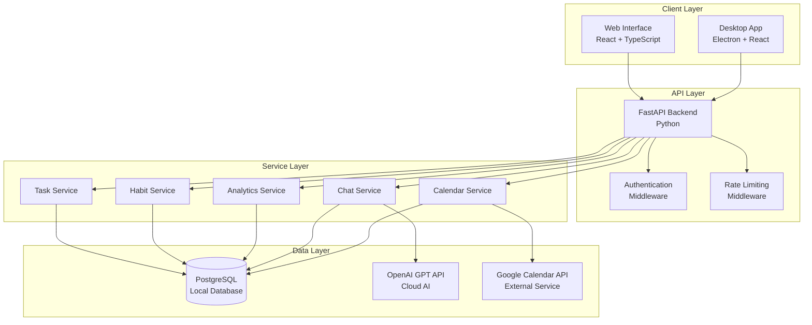

# ECHO AI Productivity Assistant - Design Document

## Overview

ECHO is architected as a hybrid productivity assistant that balances privacy with AI capabilities. The system uses a local-first approach for personal data storage while leveraging cloud-based AI for intelligent insights and natural language processing.

The architecture consists of three main layers:
- **Frontend Layer**: React/TypeScript web interface with future Electron desktop app
- **Backend Layer**: FastAPI Python service managing local data and AI integration
- **Data Layer**: PostgreSQL database for local data persistence and GPT API for AI capabilities

## Architecture

### System Architecture Diagram



### Technology Stack

**Frontend:**
- React 18 with TypeScript for type safety
- Vite for fast development and building
- Tailwind CSS for utility-first styling
- Lucide React for consistent iconography
- React Router DOM for client-side routing
- Axios for API communication
- Chart.js/Recharts for analytics visualization

**Backend:**
- FastAPI for high-performance async API
- SQLAlchemy 2.0 for database ORM
- Pydantic for data validation
- Alembic for database migrations
- Python-jose for JWT authentication
- Httpx for external API calls

**Database & External Services:**
- PostgreSQL for local data persistence
- OpenAI GPT-4 API for conversational AI
- Google Calendar API for calendar integration

**Future Desktop App:**
- Electron for cross-platform desktop application
- Same React frontend with native OS integration

## Components and Interfaces

### Frontend Components

#### Core Layout Components
```typescript
// Main application shell
interface AppShellProps {
  children: React.ReactNode;
  sidebar: React.ReactNode;
}

// Navigation sidebar
interface SidebarProps {
  currentRoute: string;
  onNavigate: (route: string) => void;
}

// Header with search and user actions
interface HeaderProps {
  onSearch: (query: string) => void;
  user: User | null;
}
```

#### Task Management Components
```typescript
// Task list with filtering and sorting
interface TaskListProps {
  tasks: Task[];
  onTaskUpdate: (task: Task) => void;
  onTaskDelete: (taskId: string) => void;
  filters: TaskFilters;
}

// Individual task item
interface TaskItemProps {
  task: Task;
  onUpdate: (task: Task) => void;
  onDelete: () => void;
  showDetails?: boolean;
}

// Task creation/editing form
interface TaskFormProps {
  task?: Task;
  onSave: (task: TaskInput) => void;
  onCancel: () => void;
}
```

#### Chat Interface Components
```typescript
// Main chat interface
interface ChatInterfaceProps {
  messages: ChatMessage[];
  onSendMessage: (message: string) => void;
  isLoading: boolean;
}

// Individual chat message
interface ChatMessageProps {
  message: ChatMessage;
  isUser: boolean;
}

// Chat input with suggestions
interface ChatInputProps {
  onSend: (message: string) => void;
  suggestions: string[];
  disabled?: boolean;
}
```

### Backend API Interfaces

#### Task Management Endpoints
```python
# Task CRUD operations
@router.get("/tasks", response_model=List[TaskResponse])
async def get_tasks(
    skip: int = 0,
    limit: int = 100,
    status: Optional[TaskStatus] = None,
    priority: Optional[TaskPriority] = None,
    db: Session = Depends(get_db)
) -> List[TaskResponse]:

@router.post("/tasks", response_model=TaskResponse)
async def create_task(
    task: TaskCreate,
    db: Session = Depends(get_db)
) -> TaskResponse:

@router.put("/tasks/{task_id}", response_model=TaskResponse)
async def update_task(
    task_id: str,
    task: TaskUpdate,
    db: Session = Depends(get_db)
) -> TaskResponse:
```

#### Chat and AI Integration
```python
# Chat with ECHO
@router.post("/chat", response_model=ChatResponse)
async def chat_with_echo(
    message: ChatMessage,
    db: Session = Depends(get_db)
) -> ChatResponse:

# Get productivity insights
@router.get("/insights", response_model=ProductivityInsights)
async def get_productivity_insights(
    timeframe: str = "week",
    db: Session = Depends(get_db)
) -> ProductivityInsights:
```

#### Analytics Endpoints
```python
# Productivity analytics
@router.get("/analytics/productivity", response_model=ProductivityAnalytics)
async def get_productivity_analytics(
    start_date: date,
    end_date: date,
    db: Session = Depends(get_db)
) -> ProductivityAnalytics:

# Habit analytics
@router.get("/analytics/habits", response_model=HabitAnalytics)
async def get_habit_analytics(
    habit_id: Optional[str] = None,
    db: Session = Depends(get_db)
) -> HabitAnalytics:
```

## Data Models

### Core Database Models

#### Task Model
```python
class Task(Base):
    __tablename__ = "tasks"
    
    id: Mapped[str] = mapped_column(String, primary_key=True, default=lambda: str(uuid4()))
    title: Mapped[str] = mapped_column(String, nullable=False)
    description: Mapped[Optional[str]] = mapped_column(Text)
    status: Mapped[TaskStatus] = mapped_column(Enum(TaskStatus), default=TaskStatus.TODO)
    priority: Mapped[TaskPriority] = mapped_column(Enum(TaskPriority), default=TaskPriority.MEDIUM)
    due_date: Mapped[Optional[datetime]] = mapped_column(DateTime(timezone=True))
    completed_at: Mapped[Optional[datetime]] = mapped_column(DateTime(timezone=True))
    created_at: Mapped[datetime] = mapped_column(DateTime(timezone=True), default=func.now())
    updated_at: Mapped[datetime] = mapped_column(DateTime(timezone=True), default=func.now(), onupdate=func.now())
    
    # Relationships
    habit_logs: Mapped[List["HabitLog"]] = relationship(back_populates="task")
```

#### Habit Model
```python
class Habit(Base):
    __tablename__ = "habits"
    
    id: Mapped[str] = mapped_column(String, primary_key=True, default=lambda: str(uuid4()))
    name: Mapped[str] = mapped_column(String, nullable=False)
    description: Mapped[Optional[str]] = mapped_column(Text)
    frequency: Mapped[HabitFrequency] = mapped_column(Enum(HabitFrequency))
    target_count: Mapped[int] = mapped_column(Integer, default=1)
    current_streak: Mapped[int] = mapped_column(Integer, default=0)
    longest_streak: Mapped[int] = mapped_column(Integer, default=0)
    created_at: Mapped[datetime] = mapped_column(DateTime(timezone=True), default=func.now())
    
    # Relationships
    logs: Mapped[List["HabitLog"]] = relationship(back_populates="habit", cascade="all, delete-orphan")
```

#### Chat History Model
```python
class ChatMessage(Base):
    __tablename__ = "chat_messages"
    
    id: Mapped[str] = mapped_column(String, primary_key=True, default=lambda: str(uuid4()))
    message: Mapped[str] = mapped_column(Text, nullable=False)
    response: Mapped[str] = mapped_column(Text, nullable=False)
    context_data: Mapped[Optional[dict]] = mapped_column(JSON)
    created_at: Mapped[datetime] = mapped_column(DateTime(timezone=True), default=func.now())
    response_time_ms: Mapped[Optional[int]] = mapped_column(Integer)
```

### Pydantic Models for API

#### Request/Response Models
```python
# Task models
class TaskBase(BaseModel):
    title: str
    description: Optional[str] = None
    priority: TaskPriority = TaskPriority.MEDIUM
    due_date: Optional[datetime] = None

class TaskCreate(TaskBase):
    pass

class TaskUpdate(BaseModel):
    title: Optional[str] = None
    description: Optional[str] = None
    status: Optional[TaskStatus] = None
    priority: Optional[TaskPriority] = None
    due_date: Optional[datetime] = None

class TaskResponse(TaskBase):
    id: str
    status: TaskStatus
    completed_at: Optional[datetime]
    created_at: datetime
    updated_at: datetime

# Chat models
class ChatMessageInput(BaseModel):
    message: str
    include_context: bool = True

class ChatResponse(BaseModel):
    response: str
    context_used: List[str]
    suggestions: List[str]
    response_time_ms: int
```

## Error Handling

### Error Response Structure
```python
class ErrorResponse(BaseModel):
    error: str
    message: str
    details: Optional[dict] = None
    timestamp: datetime
    request_id: str

class ValidationErrorResponse(ErrorResponse):
    validation_errors: List[dict]
```

### Exception Handling Strategy

#### Database Errors
- Connection failures: Retry with exponential backoff
- Constraint violations: Return structured validation errors
- Transaction failures: Rollback and return appropriate error codes

#### External API Errors
- GPT API failures: Fallback to cached responses or simplified replies
- Calendar API failures: Continue with local scheduling only
- Rate limiting: Queue requests and inform user of delays

#### Frontend Error Handling
- Network errors: Show offline indicators and retry mechanisms
- Validation errors: Inline form validation with clear messaging
- Unexpected errors: Error boundaries with user-friendly messages

## Testing Strategy

### Backend Testing
```python
# Unit tests for services
class TestTaskService:
    async def test_create_task_success(self):
        # Test successful task creation
        pass
    
    async def test_create_task_validation_error(self):
        # Test validation error handling
        pass

# Integration tests for API endpoints
class TestTaskAPI:
    async def test_get_tasks_endpoint(self):
        # Test API endpoint functionality
        pass

# Database tests
class TestTaskModel:
    def test_task_model_creation(self):
        # Test database model functionality
        pass
```

### Frontend Testing
```typescript
// Component tests with React Testing Library
describe('TaskList Component', () => {
  test('renders tasks correctly', () => {
    // Test component rendering
  });
  
  test('handles task updates', () => {
    // Test user interactions
  });
});

// Integration tests with MSW
describe('Task API Integration', () => {
  test('fetches and displays tasks', async () => {
    // Test API integration
  });
});
```

### End-to-End Testing
- Playwright tests for critical user journeys
- Database seeding for consistent test data
- Mock external APIs (GPT, Google Calendar) for reliable testing

## Performance Considerations

### Database Optimization
- Indexes on frequently queried columns (created_at, status, priority)
- Connection pooling for efficient database connections
- Query optimization for analytics endpoints
- Pagination for large data sets

### API Performance
- Response caching for analytics data
- Async processing for GPT API calls
- Rate limiting to prevent abuse
- Request/response compression

### Frontend Performance
- Code splitting for faster initial loads
- Virtual scrolling for large task lists
- Debounced search and filtering
- Optimistic updates for better UX

## Security Measures

### Authentication & Authorization
- JWT tokens for stateless authentication
- Refresh token rotation for security
- Role-based access control (future multi-user support)

### Data Protection
- Input validation and sanitization
- SQL injection prevention through ORM
- XSS protection in frontend
- CORS configuration for API access

### API Security
- Rate limiting per user/IP
- Request size limits
- API key management for external services
- Secure environment variable handling

## Deployment Architecture

### Development Environment
- Docker Compose for local development
- Hot reloading for both frontend and backend
- Local PostgreSQL instance
- Environment-specific configuration

### Production Considerations
- Containerized deployment with Docker
- PostgreSQL with proper backup strategy
- SSL/TLS termination
- Monitoring and logging setup
- Health checks and graceful shutdowns

This design provides a solid foundation for building ECHO as a robust, scalable, and maintainable productivity assistant while meeting your learning goals with PostgreSQL and maintaining the hybrid local/cloud architecture you envisioned.